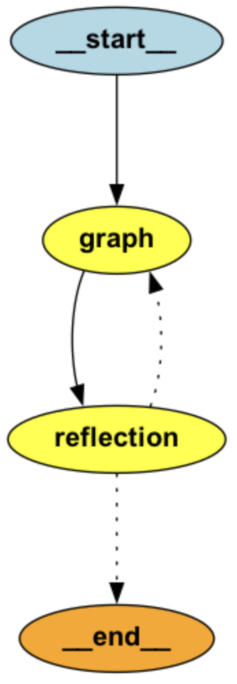

# 🦜🪞LangGraph-Reflection

This prebuilt graph is an agent that uses a reflection-style architecture to check and improve an initial agent's output.

## Installation

```
pip install langgraph-reflection
```

## Details

| Description | Architecture |
|------------|--------------|
| This reflection agent uses two subagents:<br>- A "main" agent, which is the agent attempting to solve the users task<br>- A "critique" agent, which checks the main agents work and offers any critiques<br><br>The reflection agent has the following architecture:<br><br>1. First, the main agent is called<br>2. Once the main agent is finished, the critique agent is called<br>3. Based on the result of the critique agent:<br>   - If the critique agent finds something to critique, then the main agent is called again<br>   - If there is nothing to critique, then the overall reflection agent finishes<br>4. Repeat until the overall reflection agent finishes |  |

We make some assumptions about the graphs:
- The main agent should take as input a list of messages
- The reflection agent should return a **user** message if there is any critiques, otherwise it should return **no** messages.

## Examples

Below are a few examples of how to use this reflection agent.

### LLM-as-a-Judge ([examples/llm_as_a_judge.py](examples/llm_as_a_judge.py))

In this example, the reflection agent uses another LLM to judge its output. The judge evaluates responses based on:
1. Accuracy - Is the information correct and factual?
2. Completeness - Does it fully address the user's query?
3. Clarity - Is the explanation clear and well-structured?
4. Helpfulness - Does it provide actionable and useful information?
5. Safety - Does it avoid harmful or inappropriate content?


Installation:

```
pip install langgraph-reflection langchain openevals
```

Example usage:
```python
# Define the main assistant graph
assistant_graph = ...

# Define the judge function that evaluates responses
def judge_response(state, config):
    """Evaluate the assistant's response using a separate judge model."""
    evaluator = create_llm_as_judge(   
        prompt=critique_prompt,
        model="openai:o3-mini",
        feedback_key="pass",
    )
    eval_result = evaluator(outputs=state["messages"][-1].content, inputs=None)

    if eval_result["score"]:
        print("✅ Response approved by judge")
        return
    else:
        # Otherwise, return the judge's critique as a new user message
        print("⚠️ Judge requested improvements")
        return {"messages": [{"role": "user", "content": eval_result["comment"]}]}

# Create graphs with reflection
judge_graph = StateGraph(MessagesState).add_node(judge_response)...


# Create reflection graph that combines assistant and judge
reflection_app = create_reflection_graph(assistant_graph, judge_graph)
result = reflection_app.invoke({"messages": example_query})
```

### Code Validation ([examples/coding.py](examples/coding.py))

This example demonstrates how to use the reflection agent to validate and improve Python code. It uses Pyright for static type checking and error detection. The system:

1. Takes a coding task as input
2. Generates Python code using the main agent
3. Validates the code using Pyright
4. If errors are found, sends them back to the main agent for correction
5. Repeats until the code passes validation

Installation:

```
pip install langgraph-reflection langchain openevals pyright
```

Example usage:
```python

assistant_graph = ...

# Function that validates code using Pyright
def try_running(state: dict) -> dict | None:
    """Attempt to run and analyze the extracted Python code."""
    # Extract code from the conversation
    code = extract_python_code(state['messages'])
    
    # Run Pyright analysis
    evaluator = create_pyright_evaluator()
    result = evaluator(outputs=code)
    
    if not result['score']:
        # If errors found, return critique for the main agent
        return {
            "messages": [{
                "role": "user",
                "content": f"I ran pyright and found this: {result['comment']}\n\n"
                          "Try to fix it..."
            }]
        }
    # No errors found - return None to indicate success
    return None

# Create graphs with reflection
judge_graph = StateGraph(MessagesState).add_node(try_running)...

# Create reflection system that combines code generation and validation
reflection_app = create_reflection_graph(assistant_graph, judge_graph)
result = reflection_app.invoke({"messages": example_query})
```

The code validation example ensures that generated code is not only syntactically correct but also type-safe and follows best practices through static analysis.

